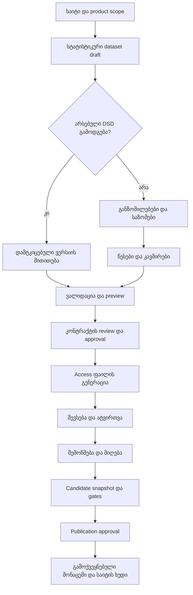

# სტატისტიკური კონტრაქტის ინიციალიზაცია და სრული lifecycle

თარიღი: 2026-09-19  
სტატუსი: **შემოთავაზებული არქიტექტურა და UX; იმპლემენტაცია NOT READY.**  
მშობელი: [საერთო სტატისტიკური კონტრაქტის გეგმა](COMMON-STATISTICAL-CONTRACT-PLAN.md)

## 1. პირდაპირი პასუხი: რას აკეთებს „სტატისტიკური მონაცემები“

ახალი საიტის შექმნისას „სტატისტიკური მონაცემების“ არჩევა ხსნის სტატისტიკური dataset-ის აღწერის პროცესს და ქმნის მხოლოდ DRAFT ჩანაწერს. ამ მომენტში ჯერ არ ვიცით დაკვირვების შინაარსი, ამიტომ მზა შესავსები ცხრილი ვერ შეიქმნება.

მომხმარებელი აღწერს, რას წარმოადგენს ერთი ჩანაწერი, რა განზომილებებით გამოირჩევა და რას ზომავს. ამის შემდეგ სისტემა აჩვენებს ზუსტ ცხრილს preview-ში. დამტკიცებული კონტრაქტიდან Delivery ქმნის Access-ის შესავსებ ცხრილებსა და metadata-ს.

სერვერზე ინიციალიზდება registry-ის ჩანაწერები და versioned კავშირები. ყოველი ახალი საიტი არ იწვევს ახალ SQL schema-ს ან business table-ს. საერთო პლატფორმის სქემის საჭირო ცვლილება ჩვეულებრივი reviewed migration/release-ით სრულდება და onboarding-ისგან დამოუკიდებელია.

საიტი არის consumer; data product/dataset შეიძლება რამდენიმე საიტმა გამოიყენოს უფლებამოსილი binding-ით. საიტის შექმნა მონაცემის სემანტიკური იდენტობის ავტომატურ გამრავლებას არ უნდა იწვევდეს.

## 2. არქიტექტურული არჩევანი

ამ ამოცანისთვის შეთავაზებული კომბინაციაა **დეკლარაციული კონტრაქტი + კომპილაციის ეტაპები + მდგომარეობებით მართვადი workflow + provider adapters**.

| მიდგომა | კონკრეტული პასუხისმგებლობა |
|---|---|
| Declarative contract | მომხმარებელი აღწერს მნიშვნელობას და შეზღუდვებს |
| Compiler pipeline | ერთ აღწერას ამოწმებს, resolves references-ს და გარდაქმნის საერთო შესრულების მოდელად |
| Explicit state machine | draft, review, approval და publication-ის დაშვებული გადასვლები |
| Ports and Adapters | Access/სხვა წყარო და SDMX/სხვა export გამოიყოფა საერთო სემანტიკისგან |
| Versioned registry | დამტკიცებული concept, measure, unit, classifier და policy ხელახლა გამოიყენება |
| Durable job + idempotency | ხანგრძლივი generation/import restart-ის შემდეგ გრძელდება დუბლირების გარეშე |

ერთი universal pattern ყველა პასუხისმგებლობას არ მოიცავს. Event sourcing ან ახალი microservice მხოლოდ ამ wizard-ის არსებობის გამო არ გვჭირდება. თავდაპირველად workflow შეიძლება იმავე application-ში და transaction boundary-ში განხორციელდეს. თუ transactional ცვლილებას asynchronous worker-ის შეტყობინება მოსდევს, job/outbox ჩანაწერი იმავე transaction-ში ინახება; consumer განმეორებით მიწოდებას უსაფრთხოდ ამუშავებს.

## 3. მომხმარებლის timeline

| ეტაპი | რას აკეთებს მომხმარებელი | რას აკეთებს სისტემა | შედეგი / შემდეგი ეტაპის პირობა |
|---|---|---|---|
| 1. კონტექსტი | ირჩევს ორგანიზაციას/product-ს და საიტს | ამოწმებს scope-ს; ეძებს უკვე არსებულ dataset-ს | ახალი draft ან არსებული dataset-ის გამოყენება |
| 2. მონაცემის ოჯახი | ირჩევს „სტატისტიკური“ | ქმნის authoring draft-ს და აჩვენებს შესაბამის კითხვებს | სტატისტიკური აღწერის ფორმა |
| 3. სტრუქტურის არჩევა | იყენებს არსებულ სტრუქტურას ან ქმნის ახალს | compatible DSD-ებს აჩვენებს; reuse-ზე pin-ს უკეთებს ვერსიას | ახალი dataset ყოველთვის ახალ DSD-ს არ მოითხოვს |
| 4. ერთი ჩანაწერის მნიშვნელობა | აღწერს, მაგალითად „წელი × რეგიონი × სქესი“ | აწყობს dimension key-ს და გასაგებ განმარტებას | grain ცალსახაა |
| 5. განზომილებები | ირჩევს concept-ს, ტიპს, კლასიფიკატორს | ამოწმებს ვერსიებს, required-ს და uniqueness-ს | დალაგებული dimensions |
| 6. საზომები | ამატებს რაოდენობას, პროცენტს ან სხვა მაჩვენებელს | აკავშირებს measure/unit/precision-ს; ამოწმებს საერთო grain-ს | ერთი ან რამდენიმე measure |
| 7. განმარტებები და წესები | უთითებს საჭირო სტატუსებს, missing წესებს და სხვა metadata-ს | აჩვენებს defaults-ს და attribute-ის მოქმედების დონეს | policy references; დაუდასტურებელი სემანტიკა არ გამოიცნობა |
| 8. მიღების ფორმატი | ირჩევს Access-ს ან მხარდაჭერილ adapter-ს | ამოწმებს provider-ის ტიპების/ზომის შესაძლებლობებს | შევსებისა და import-ის mapping |
| 9. Preview | ნახულობს რეალურ სვეტებსა და მაგალითის validation-ს | აჩვენებს data/metadata/lineage ჯგუფებს, შეცდომებსა და compatibility diff-ს | ყველა blocking შეცდომა გამოსწორებულია |
| 10. Review/approval | უფლებამოსილი პირი ამტკიცებს ზუსტ revision-ს | ინახავს immutable contract-ს, resolved dependencies-ს და approval evidence-ს | APPROVED contract |
| 11. ფაილის გენერაცია | ითხოვს „ჩამოტვირთე შესავსები ფაილი“ | ქმნის typed tables, metadata, classifiers და lineage envelope-ს | versioned artifact + checksum + build provenance |
| 12. შევსება | ირჩევს კოდებს და ავსებს მნიშვნელობებს | ფორმა ეხმარება; სრული authority server-ზე რჩება | შევსებული source artifact |
| 13. ატვირთვა/preview | ატვირთავს ფაილს | არტეფაქტს არეგისტრირებს; ამოწმებს contract, scope, schema და rows-ს | გასაგები validation ანგარიში |
| 14. მიღება | უფლებამოსილი მოქმედებით იწყებს import-ს | durable load, canonical materialization, lineage და reconciliation | candidate snapshot |
| 15. ხარისხი და გამოქვეყნება | განიხილავს შედეგს და ამტკიცებს publication-ს | ამოწმებს quality/privacy/reconciliation/compatibility gates-ს | მხოლოდ წარმატებისას PUBLISHED snapshot |
| 16. საიტის დაკავშირება | ირჩევს dataset projection-ს/ხედს | approved consumer binding-ს აკავშირებს გამოქვეყნებულ snapshot-თან | site API/chart/export |

საიტის binding/projection შეიძლება draft-ში უფრო ადრე მომზადდეს, მაგრამ საჯარო serving მხოლოდ release პირობების დაკმაყოფილების შემდეგ იწყება. კონტრაქტის დამტკიცება მონაცემების გამოქვეყნებას არ ნიშნავს.



## 4. რას ქმნის initialization და რა როდის უკავშირდება

| ობიექტი | შექმნა / კავშირი | invariant |
|---|---|---|
| Product/site context | არსებული registry-ის გამოყენება ან შესაბამისი authorized onboarding | caller-ის ტექსტით tenant scope ვერ იცვლება |
| Dataset draft | „სტატისტიკური“-ს არჩევის შემდეგ explicit create command | persistent identity მხოლოდ შენახვისას; გადატვირთვა ახალ dataset-ს არ ქმნის |
| DSD draft | მხოლოდ ახალი სტრუქტურის საჭიროებისას | reused DSD უცვლელია; შესწორება ახალ revision-ში |
| Concepts/units/measures/codelists | registry lookup, ახალი მოთხოვნა steward review-ში | დასახელების დამთხვევა semantic identity-ის დასადგენად საკმარისი არ არის |
| Dataset→DSD | ზუსტი approved reference | ერთი აქტიური contract revision-ის binding ცალსახაა |
| Source fields→components | compiler-generated, preview-ში ხილული mapping | თითოეული input column declared; კავშირის ambiguity rejected |
| Resource→dataset/observation | მხოლოდ რეალური საჭიროებისას approved relation | ფაილის რესურსი არ არის სტატისტიკური measure-ის იდენტობა |
| Site→projection→dataset | consumer configuration | projection არ ქმნის მონაცემის მეორე authority-ს |
| Snapshot→contract/dependencies | ingestion/release evidence | snapshot ყოველთვის იმავე resolved semantics-ით იკითხება |

Site title, access filename, table caption და translated label არ გამოიყენება join key-დ. Reference-ები namespace-ით და ვერსიით იშიფრება; runtime numeric IDs package-ში არ გადადის. სხვა tenant-ის საერთო reference-ის გამოყენებას explicit visibility/access policy სჭირდება.

## 5. კონტრაქტის grammar და compiler

ფორმა და API ერთსა და იმავე canonical authoring model-ს წერენ; მათ ცალ-ცალკე წესები არ აქვთ. საბოლოო wire schema უნდა იყოს versioned JSON Schema 2020-12 პროფილი ან repository-ის არსებული schema stack-ის დასაბუთებული თავსებადი გაგრძელება. JSON Schema ამოწმებს ფორმას; semantic validation ამოწმებს reference resolution-ს, grain-ს, units-სა და უფლებებს. `format` assertion ცალკე უნდა ჩაირთოს/შემოწმდეს; მხოლოდ annotation-ზე დაყრდნობა არ შეიძლება. [ოფიციალური JSON Schema 2020-12](https://json-schema.org/draft/2020-12)

ქვემოთ არის ლოგიკური მონახაზი და არა უკვე მხარდაჭერილი executable JSON კონტრაქტი:

```text
ContractDraft
  profileRef
  datasetIdentity
  structureChoice
    existingStructureRef
    OR inlineStructureDraft
      dimensions[]: conceptRef, representationRef, required
      measures[]: measureRef
      attributes[]: conceptRef, representationRef, attachment
  policyRefs[]
  sourceProfileRef
  presentation: captions, order, grouping
  consumerBindings[] (optional)
```

`existingStructureRef` და `inlineStructureDraft` ურთიერთგამომრიცხავია. Draft reference-ები approval-მდე უნდა გადაიქცეს approved immutable dependency graph-ად. unit/type/concept, რომელიც measureRef-ით უკვე ცნობილია, ხელახლა რედაქტირებად ველად არ იგზავნება. UI resolved მნიშვნელობას აჩვენებს. ამით თავიდან ვიცილებთ მშობელი გეგმის ლოგიკურ component/measure პროექციებს შორის authority-ის დუბლირებას.

Compiler-ის ეტაპები:

1. Parse/schema validation: უცნობი fields/roles/profile version უარყოფილია.
2. Resolve: references, უფლებები, ზუსტი ვერსიები და dependency cycle check.
3. Semantic validation: dimensions/key, measure grain, unit/type, attribute attachment, rule applicability.
4. Normalize: shared intermediate representation; deterministically ordered components და explicit resolved defaults.
5. Capability check: Access adapter-ის numeric/date/identifier/column limitations; unsupported მოთხოვნაზე ახსნა.
6. Plan: generated table/column mapping, keys/relations, UI metadata, validators და compatibility report.
7. Approval binding: immutable revision + dependency digest + semantic plan digest.
8. Emit: approved plan-იდან Access ან სხვა მხარდაჭერილი არტეფაქტი.

ყველა backend ერთი intermediate representation-ით ხელმძღვანელობს. Access, validator და export არ უნდა ქმნიდეს სემანტიკის სამ დამოუკიდებელ ინტერპრეტაციას. Adapter-specific physical names მხოლოდ plan-შია; ისინი canonical component identity-ს არ ცვლის.

Semantic plan-ის digest უნდა ეყრდნობოდეს განსაზღვრულ canonical serialization-ს. build manifest-ში დაფიქსირდება generator version/configuration და dependency versions. ACCDB binary checksum build-specific შეიძლება იყოს; semantic reproducibility ცალკე დამტკიცდება. ერთი job-ის retry უკვე დასრულებულ immutable artifact-ს აბრუნებს.

## 6. ერთმანეთისგან გამიჯნული მდგომარეობები

სახელები ქვემოთ დიზაინის vocabulary-ა. მოქმედ enum-ებთან mapping დაფიქსირებულია [რეესტრის Q40, §4.5-ში](STATISTICAL-CONTRACT-OPEN-QUESTIONS.md): ახალი enum მნიშვნელობა არ ემატება.

| Aggregate | მდგომარეობები / გადასვლები |
|---|---|
| Contract | DRAFT → IN_REVIEW → APPROVED → DEPRECATED; review-ის დაბრუნება draft-ში ახალი edit version-ით |
| Generation job | QUEUED → RUNNING → SUCCEEDED ან FAILED; failed retry ინარჩუნებს იგივე intent-ს |
| Ingestion | RECEIVED → VALIDATING → VALIDATED → INGESTING → COMPLETED; შესაბამის ეტაპზე REJECTED/FAILED |
| Snapshot | CANDIDATE → REVIEW_REQUIRED → PUBLISHED, მხოლოდ gates+approval-ის შემდეგ; რეალური enum mapping baseline-ში მოწმდება |

Approval ეხება ზუსტ revision/digest-ს. თუ review-ის შემდეგ draft შეიცვალა, ძველი approval ახალ შინაარსზე აღარ ვრცელდება. optimistic concurrency version/ETag stale edit-ს ბლოკავს. contract approval, import execution და publication სხვადასხვა უფლებებია, არსებული policy-ის შესაბამისად.

ინიციალიზაცია ატომურად ქმნის draft-სა და მის სავალდებულო კავშირებს. request idempotency key scope-ით უნიკალურია; იგივე key და განსხვავებული payload იწვევს conflict-ს. ამ პროცესში code generation ან გარე ფაილის ჩაწერა DB transaction-ს არ აჩერებს: ისინი durable job-ით სრულდება.

## 7. მომხმარებლის ინტერფეისის სიმარტივე

- პირველი ეკრანი მხოლოდ data family-სა და reuse/create არჩევანს აჩვენებს.
- კითხვას „რას წარმოადგენს ერთი სტრიქონი?“ მოსდევს ცოცხალი ცხრილის preview.
- განზომილების/საზომის დამატება რეალურ მომავალ სვეტს აჩენს; ტექნიკური metadata ცალკე გასახსნელ განყოფილებაშია.
- ერთეული/ტიპი reusable measure-იდან ივსება; მისი ცვლილება definition workflow-ს იწყებს.
- საერთო წელი/რეგიონი მხოლოდ explicit constant binding-ით გადადის ფორმის სათაურში.
- save draft არ მოითხოვს სრულ კონტრაქტს; submit review მოითხოვს სრულ semantic validation-ს.
- validation მიუთითებს კონკრეტულ კომპონენტს/სტრიქონს, მიზეზსა და გამოსწორების გზას.
- publish, approve და confidentiality ცვლილებები არასოდეს ირთვება checkbox-ის მონიშვნით ავტომატურად.

## 8. მაგალითი: ახალი შრომის სტატისტიკის საიტი

1. აირჩევა არსებული product ან იქმნება authorized product context.
2. ინიშნება „სტატისტიკური მონაცემები“ და „ახალი dataset“.
3. compatible DSD თუ უკვე არსებობს, გამოიყენება მისი დამტკიცებული ვერსია.
4. სხვა შემთხვევაში განისაზღვრება TIME_PERIOD, REGION, SEX, AGE_GROUP.
5. ემატება EMPLOYED და UNEMPLOYED measure references. კლასიფიკატორები/ერთეულები reuse-ით ივსება.
6. preview აჩვენებს ექვს შესავსებ სვეტს. საჭიროებისამებრ ემატება სტატუსი; carrier/json_path/checksum მომხმარებელთან არ ჩანს.
7. approval-ის შემდეგ გენერირდება Access: შესავსები ცხრილი, კონტრაქტის metadata, გამოყენებული ცნობარები და ავტომატური lineage-ის სტრუქტურა.
8. filled file გადის validation/import/reconciliation-ს და publication review-ს.
9. საიტის ცხრილი/დიაგრამა projection-ით კითხულობს published snapshot-ს.

შემდეგ სხვა საიტს შეუძლია იგივე dataset-ზე authorized binding გამოიყენოს. ახალი საზომის დამატება კონტრაქტის ახალი revision-ია; მხოლოდ ახალი წლის rows-ის დამატება მოქმედი კონტრაქტით მიიღება, თუ გამოცხადებული constraints ამას უშვებს.

## 9. failure, recovery და acceptance

| სცენარი | სავალდებულო შედეგი |
|---|---|
| double-click/retry create | ერთი draft, duplicate links-ის გარეშე |
| ორი concurrent editor | stale update rejected; ჩუმი overwrite არ ხდება |
| dependency იცვლება review-ისას | pinned revision უცვლელია; ახალზე გადასვლა ახალი review-ით |
| crash generation-ისას | incomplete artifact არ ქვეყნდება; retry/checkpoint/cleanup მხოლოდ job-owned temporary scope-ში |
| არასწორი schema/code/unit | report კონკრეტული მიზეზით; publication შეუძლებელია |
| import-ის ნაწილობრივი შესრულება | checkpoint და idempotent replay; incomplete load snapshot-ს ვერ აქვეყნებს |
| user loses permission | execution-time authorization recheck; draft history შენარჩუნდება |
| სხვა tenant-ის ref | access denied, მონაცემის გაჟონვის გარეშე |
| consumer rollback | წინა compatible published snapshot/binding; ახალი evidence უცვლელად რჩება |

განხორციელების gate-ები:

- [ ] workflow state transitions და unauthorized transitions unit/negative tests.
- [ ] create/approve/generate concurrency და retry integration tests.
- [ ] compiler deterministic semantic plan და reference-resolution tests.
- [ ] განსხვავებული provider adapters-ის semantic equivalence tests.
- [ ] ორი პროექტის დამოუკიდებელი onboarding core-code branching-ის გარეშე.
- [ ] reuse-ით ახალი site არ ქმნის duplicate DSD/measure/dataset-ს.
- [ ] Access-ის რეალური generation/open/fill/upload/import round-trip.
- [ ] contract approval-ს შემდეგ შეცვლილი metadata rejection.
- [ ] crash/recovery, tenant-negative, publication gates და rollback evidence.
- [ ] telemetry: job state/duration, validation codes, retry counts, dependency digests; confidential values logs-ში არ იწერება.

დოკუმენტაცია აღწერს სამიზნე workflow-ს. UI/API/job/contract schema-ის არსებობა და ამ checklist-ის შესრულება ცალკე მტკიცებულებით დასადასტურებელია.
